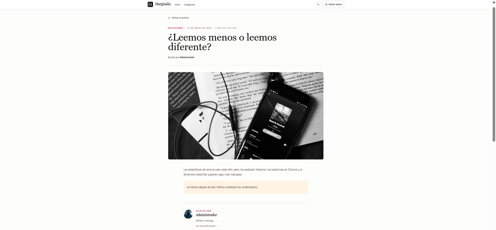
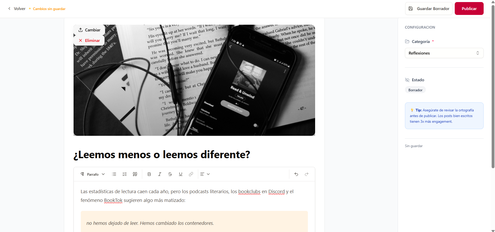

<h1>
  
  Marginalia — Literary Blog · Frontend
</h1>

React frontend for **Marginalia**, a literary blogging platform: a public reading site plus a role-gated panel for writing, moderation, and administration.

[](LICENSE)

Readers browse a paginated feed, categories, and author profiles. Authors write in a TipTap rich-text editor with cover images and draft/publish workflow. Moderators review posts, and admins manage users, categories, and author promotion requests. Authentication uses an HttpOnly session cookie set by the [Marginalia API](https://github.com/IbanezCamilo/marginalia-api).

```bash
git clone https://github.com/IbanezCamilo/marginalia-web.git && cd marginalia-web
cp .env.sample .env   # point VITE_API_URL at your backend
npm install && npm run dev
```

## Table of Contents

- [Features](#features)
- [Screenshots](#screenshots)
- [Stack](#stack)
- [Getting Started](#getting-started)
- [Environment Variables](#environment-variables)
- [Scripts](#scripts)
- [Routes](#routes)
- [Architecture](#architecture)
- [Testing](#testing)
- [License](#license)

## Features

**Public site**
- Post feed with pagination and quote of the day (served by an edge Worker)
- Individual post page with rich content (HTML sanitized with DOMPurify)
- Author profile page with their publications
- Browse by category and unified catalog page
- About page, custom 404 and error pages

**Accounts**
- Register / login with cookie-based session (HttpOnly cookie set by the backend)
- Email verification flow (check-your-email page + emailed verification link)
- Editable profile: name, bio, and profile photo
- Role hierarchy: `READER → AUTHOR → MODERATOR → ADMIN → OWNER`

**Panel** (`/user/*`)
- Dashboard with post statistics
- Post CRUD with cover image upload
- TipTap editor (bold, italic, underline, alignment, links, character count) rendered full-screen
- Draft ↔ published status toggle with optimistic updates
- Post moderation (MODERATOR+)
- Category, user, and author-request management (ADMIN+)

## Screenshots

| Public feed | Individual post |
|---|---|
|  |  |

| Admin dashboard | TipTap editor |
|---|---|
|  |  |

## Stack

| Technology | Version | Role |
|---|---|---|
| React | 19 | UI framework |
| Vite | 7 | Build tool / dev server |
| Tailwind CSS | 4 | Styles (Vite plugin, no PostCSS) |
| shadcn/ui + Radix UI | — | UI component primitives |
| React Router | 7 | Routing (`createBrowserRouter`) |
| TipTap | 3 | Rich text editor |
| DOMPurify | 3 | HTML sanitization |
| Sonner | 2 | Toast notifications |
| Vitest + Testing Library | 4 / — | Unit and component tests (jsdom) |

## Getting Started

### Requirements

- Node.js 20+ (Vite 7 requirement; the Docker image builds on Node 22)
- Backend running — see the [Marginalia API repository](https://github.com/IbanezCamilo/marginalia-api)

### Steps

```bash
git clone https://github.com/IbanezCamilo/marginalia-web.git
cd marginalia-web
cp .env.sample .env
# Edit .env with your backend URL
npm install
npm run dev
```

The dev server starts at `http://localhost:5173`.

## Environment Variables

Copy `.env.sample` → `.env` and fill in your values:

| Variable | Required | Description | Example |
|---|---|---|---|
| `VITE_API_URL` | Yes | Backend origin, **without** `/api` (the app appends it). Also used to build image URLs. | `http://localhost:8080` |
| `VITE_QUOTES_URL` | No | Origin of the quote-of-the-day edge Worker. The endpoint is public, so dev works without it. | Defaults to `https://edge.readmarginalia.net` |

Both are consumed exclusively through `src/lib/config.js` (`API_URL` = `VITE_API_URL` + `/api`, `BASE_URL` = `VITE_API_URL`). Do not read them directly in components or services.

> [!IMPORTANT]
> Vite inlines `VITE_*` into the bundle at **build time**, not at runtime. For a Docker/Dokploy deploy, `VITE_API_URL` must be set as a **build-time variable** (a Docker `ARG`), not a runtime container env var — see the `Dockerfile`. Prod value: `https://api.readmarginalia.net`.

> [!NOTE]
> `.env` and `.env.local` are in `.gitignore` and must never be committed.

## Scripts

```bash
npm run dev         # Dev server at localhost:5173
npm run build       # Production build → dist/
npm run preview     # Preview the production build locally
npm run lint        # ESLint (flat config v9)
npm run test        # Vitest, single run
npm run test:watch  # Vitest in watch mode
```

## Routes

| Route | Access | Description |
|---|---|---|
| `/` | Public | Main feed |
| `/post/:slug` | Public | Individual post |
| `/author/:authorId` | Public | Public author profile |
| `/categoria/:slug` | Public | Posts by category |
| `/catalog` | Public | Unified catalog |
| `/about` | Public | About page |
| `/auth/login` | Public | Sign in |
| `/auth/register` | Public | Sign up |
| `/auth/check-email` | Public | "Check your email" notice after registering |
| `/verify-email` | Public | Email verification landing (`?token=` link from the email) |
| `/user/dashboard` | AUTHOR+ | Post statistics |
| `/user/posts` | AUTHOR+ | My posts list and management |
| `/user/create-post` | AUTHOR+ | New post editor |
| `/user/edit-post/:id` | AUTHOR+ | Edit existing post |
| `/user/profile` | All authenticated | Profile and photo |
| `/user/author-request` | READER | Request author role |
| `/user/moderacion` | MODERATOR+ | Post moderation |
| `/user/categories` | ADMIN+ | Category management |
| `/user/solicitudes` | ADMIN+ | Author request management |
| `/user/usuarios` | ADMIN+ | User management |

## Architecture

```text
src/
├── features/          # Domain modules (auth, posts, categories, profile, quotes…)
│   └── <feature>/
│       ├── pages/     # Page components (import hooks only, never services)
│       ├── components/
│       ├── hooks/     # Local state, service calls, toasts
│       └── services/  # API calls (stateless)
├── pages/             # Top-level public pages
├── panel/layout/      # Panel shell: AdminLayout, SidebarCollapsible, TopBar
├── lib/
│   ├── apiClient.js   # Fetch wrapper: sends credentials so the browser attaches the HttpOnly session cookie, detects FormData/JSON, handles 401
│   └── config.js      # Reads env vars (VITE_API_URL, VITE_QUOTES_URL)
├── components/ui/     # shadcn/ui primitives
├── shared/            # Shared components and pages (Navbar, Footer, 404…)
├── utils/             # Utilities: imageUtils, postValidation, roles
└── routes/AppRouter.jsx
```

Pages import hooks only. Hooks call services. Services use `apiClient`. Nothing calls `apiClient` directly from a component.

## Testing

```bash
npm run test        # single run
npm run test:watch  # watch mode
```

Tests run on Vitest with Testing Library and jsdom. Config lives in the `test` block of `vite.config.js`; global setup in `src/test/setup.js`.

## License

[MIT](LICENSE) © Camilo Ibañez
