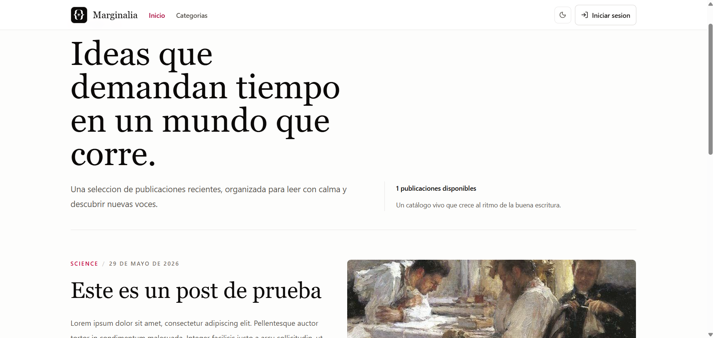
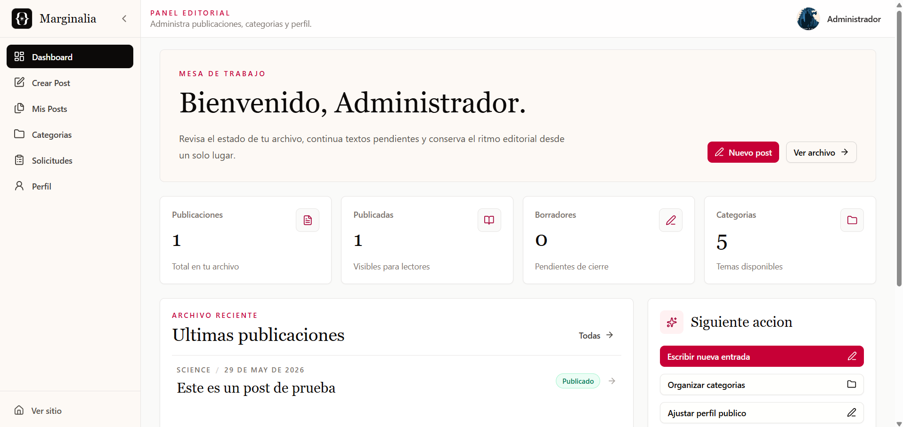

# Marginalia — Literary Blog · Frontend

User interface for **Marginalia**, a literary blogging platform. Includes a public reading site and an admin panel for authors, with a dashboard, post management, categories, and user profile.

## Stack

| Technology | Version | Role |
|---|---|---|
| React | 19 | UI framework |
| Vite | 7 | Build tool / dev server |
| Tailwind CSS | 4 | Styles (Vite plugin, no PostCSS) |
| shadcn/ui + Radix UI | — | UI component primitives |
| React Router | 7 | Routing (createBrowserRouter) |
| TipTap | 3 | Rich text editor |
| DOMPurify | 3 | HTML sanitization |
| Sonner | 2 | Toast notifications |
| JWT | — | Authentication (stored in localStorage) |

## Features

**Public site**
- Post feed with pagination
- Individual post page with rich content (sanitized HTML)
- Author profile page with their publications
- Browse by category

**Admin panel** (`/user/*`)
- Login / register with JWT and persistent session
- Dashboard with post statistics
- Post CRUD with cover image upload
- TipTap editor (bold, italic, underline, alignment, links, character count)
- Draft ↔ published status toggle with Optimistic Update
- Category management (ADMIN only)
- Author role request management (ADMIN only)
- Editable profile: name, bio, and profile photo
- Role system: `READER → AUTHOR → MODERATOR → ADMIN`

## Architecture

```
src/
├── features/          # Domain modules (auth, posts, categories, profile…)
│   └── <feature>/
│       ├── pages/     # Page components (import hooks only, never services)
│       ├── components/
│       ├── hooks/     # Local state, service calls, toasts
│       └── services/  # API calls (stateless)
├── pages/             # Top-level public pages
├── panel/layout/      # Panel shell: AdminLayout, SidebarCollapsible, TopBar
├── lib/
│   ├── apiClient.js   # Fetch wrapper: injects JWT, detects FormData/JSON, handles 401
│   └── config.js      # Reads env vars (VITE_API_URL, VITE_BASE_URL)
├── components/ui/     # shadcn/ui primitives
├── shared/            # Shared components and pages (Navbar, Footer, 404…)
├── utils/             # Utilities: imageUtils, postValidation, editorContent
└── routes/AppRouter.jsx
```

Pages import hooks only. Hooks call services. Services use `apiClient`. Nothing calls `apiClient` directly from a component.

## Getting Started

### Requirements
- Node.js 18+
- Backend running — see [backend repository](https://github.com/IbanezCamilo/blog-literario-backend)

### Steps

```bash
git clone https://github.com/IbanezCamilo/blog-literario-frontend.git
cd blog-literario-frontend
cp .env.sample .env
# Edit .env with your backend URLs
npm install
npm run dev
```

The dev server starts at `http://localhost:5173`.

## Environment Variables

Copy `.env.sample` → `.env` and fill in your values:

| Variable | Description | Example |
|---|---|---|
| `VITE_API_URL` | Backend base URL (without `/api`) | `http://localhost:8080` |
| `VITE_BASE_URL` | Base URL used to construct image URLs | `http://localhost:8080` |

Both variables are consumed exclusively through `src/lib/config.js`. Do not use them directly in components or services.

> `.env` and `.env.local` are in `.gitignore` and must never be committed.

## Scripts

```bash
npm run dev      # Dev server at localhost:5173
npm run build    # Production build → dist/
npm run preview  # Preview the production build locally
npm run lint     # ESLint (flat config v9)
```

## Routes

| Route | Access | Description |
|---|---|---|
| `/` | Public | Main feed |
| `/post/:slug` | Public | Individual post |
| `/author/:authorId` | Public | Public author profile |
| `/categoria/:slug` | Public | Posts by category |
| `/auth/login` | Public | Sign in |
| `/auth/register` | Public | Sign up |
| `/user/dashboard` | AUTHOR+ | Post statistics |
| `/user/posts` | AUTHOR+ | My posts list and management |
| `/user/create-post` | AUTHOR+ | New post editor |
| `/user/edit-post/:id` | AUTHOR+ | Edit existing post |
| `/user/profile` | All | Profile and photo |
| `/user/author-request` | READER | Request author role |
| `/user/categories` | ADMIN | Category management |
| `/user/solicitudes` | ADMIN | Author request management |

## Screenshots

| Public feed | Admin dashboard |
|---|---|
|  |  |
